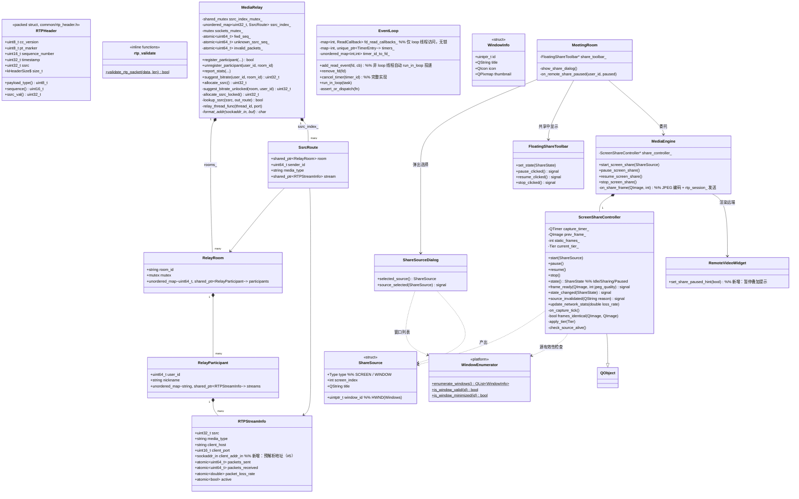
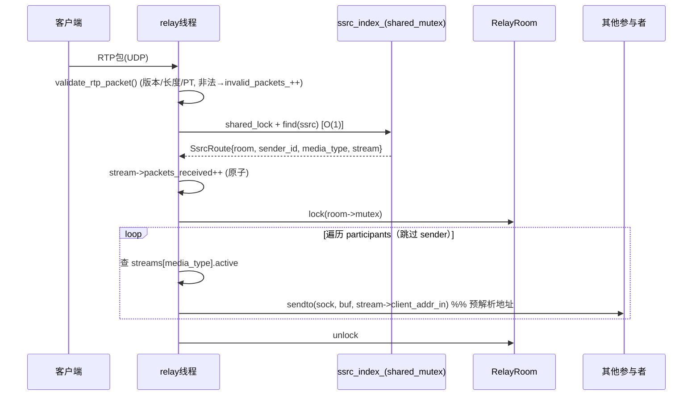
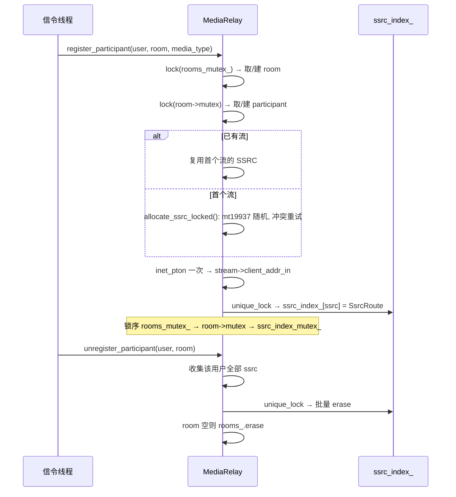
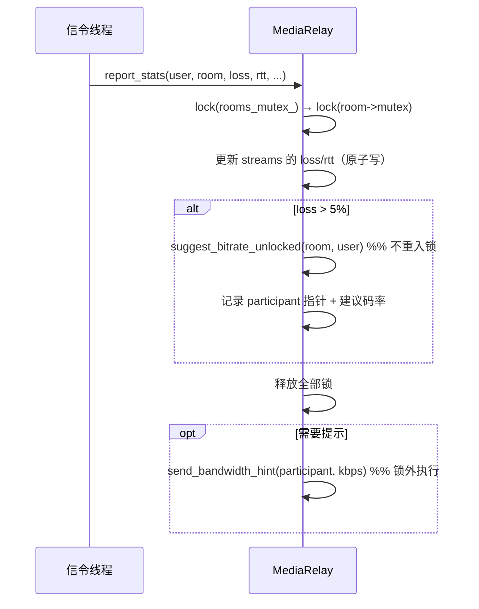
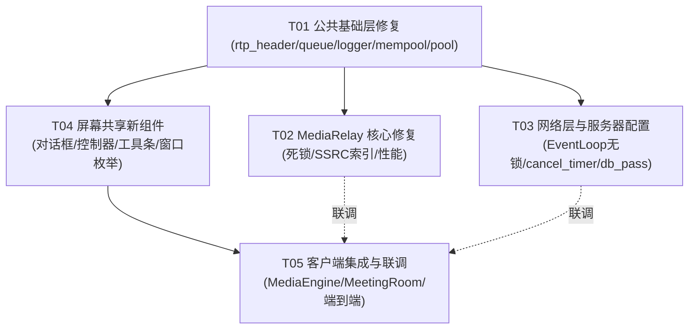

# WeMeet v2.1 修复与屏幕共享完善 — 系统设计文档

- **作者**: 高见远（软件架构师）
- **输入**: docs/PRD-optimize.md（18 项缺陷修复 + 6 项屏幕共享完善）
- **技术栈**: C++17 / Qt6 / epoll / MySQL（既有栈，不引入新第三方库）

---

# Part A: 系统设计

## 1. 实现方案（Implementation Approach）

### 1.1 核心技术难点与对策

| 难点 | 对策 |
|------|------|
| 递归死锁（report_stats → suggest_bitrate 重入非递归 mutex） | `_unlocked` 私有版本约定 + 锁外发送带宽提示 |
| SSRC 反查 O(N) 在每包热路径 | 新增 `ssrc → route` 哈希索引，`std::shared_mutex` 读写分离，注册/注销时维护 |
| EventLoop 事件分发加锁 | 确立"单线程 Reactor"语义：所有 fd 回调表操作收敛到 loop 线程（跨线程调用自动 run_in_loop 投递），热路径零锁 |
| 逐包 inet_pton / inet_ntoa | 注册时预解析 `sockaddr_in` 存入 RTPStreamInfo；日志地址用 `inet_ntop` + 栈缓冲区 |
| 窗口级共享枚举（跨平台） | 平台抽象 WindowEnumerator：Windows 用 Win32 EnumWindows，Linux 降级返回空列表（UI 提示仅支持屏幕） |
| 抓帧性能 | 整帧 memcmp 帧差检测 + 静止降帧（1 fps）+ 三档帧率/JPEG 质量自适应 |
| RTPHeader 重复定义 | 抽取 `src/common/rtp_header.h`（纯 C++17、无 Qt 依赖），server/client 共用 |

### 1.2 关键设计决策

**D1 — SSRC 索引结构（需求 #3、#12、#17 的载体）**

```cpp
struct SsrcRoute {
    std::shared_ptr<RelayRoom> room;        // 持有房间，绕开 rooms_mutex_
    uint64_t sender_id;
    std::string media_type;
    std::shared_ptr<RTPStreamInfo> stream;  // 直接更新统计，无需再遍历
};
std::unordered_map<uint32_t, SsrcRoute> ssrc_index_;   // + std::shared_mutex
```

- **维护时机**：`register_participant` 插入；`unregister_participant` 删除该用户全部 SSRC；`update_media_status` 不涉及。
- **线程安全**：relay 线程查找用 `shared_lock`（多线程并发读，O(1)）；注册/注销用 `unique_lock`。
- **锁序约定**（防死锁，全局唯一顺序）：`rooms_mutex_ → room->mutex → ssrc_index_mutex_`。转发热路径只取 `ssrc_index_ 共享锁 → room->mutex`，不再触碰 `rooms_mutex_`。

**D2 — 死锁修复（需求 #1）**

- `suggest_bitrate()` 保留公共接口（自加锁），内部委托给 `suggest_bitrate_unlocked()`（假定调用者已持锁，命名后缀约定）。
- `report_stats()` 在持锁内调用 `_unlocked` 版本算出建议码率，**释放全部锁后**再调用 `send_bandwidth_hint()`（避免在锁内做 IO/回调）。

**D3 — EventLoop 无锁化（需求 #6、#8）**

- `add_read_event / remove_fd / enable_write / disable_write / run_after / run_every / cancel_timer` 入口检查 `is_in_loop_thread()`：在 loop 线程直接执行；否则 `run_in_loop` 投递后返回。
- 删除 `fd_callbacks_mutex_`；`loop()` 中直接读 `fd_read_callbacks_`（仅 loop 线程访问）。
- 构造函数注册 wakeup fd 时 loop 尚未运行（`running_==false`），允许直接路径。
- `cancel_timer` 落地：`timers_` 仍按 fd 索引，新增 `std::unordered_map<int,int> timer_id_to_fd_`；取消 = `epoll_ctl DEL → close(fd) → erase 两表`。

**D4 — 屏幕共享组件拆分**

新增三个 UI/控制组件 + 一个平台抽象，MediaEngine 只做"委托 + 编码发送"：

```
MeetingRoom ──打开──► ShareSourceDialog ──产出──► ShareSource{type, screen_index, hwnd, title}
    │                                                   │
    │ start                                             ▼
    ▼                                          ScreenShareController
FloatingShareToolbar ◄──状态信号── (抓帧定时器/帧差检测/自适应档位/源失效监控)
    │ pause/resume/stop                                 │ frame_ready(QImage, quality)
    ▼                                                   ▼
MediaEngine.pause/resume/stop_screen_share      MediaEngine: JPEG 编码 → RtpSession → 中继
```

**D5 — 帧差检测与静止降���（需求 #22）**

- 抓帧后 `QImage::convertToFormat(Format_RGB32)`，与上一帧逐行 `memcmp(constBits, prev.bits, bytesPerLine)`（尺寸变化直接判不同）。
- 相同 → `static_frames_++`，连续 ≥3 帧静止后把定时器间隔降到 1000ms（1 fps 心跳帧，维持远端画面与 FEC/统计存活）。
- 不同 → 立即恢复当前档位帧率并发送。
- 整帧 memcmp 对 1080p RGB32 约 8MB，内存带宽下耗时 <2ms，满足"简单可用"（脏矩形留作后续）。

**D6 — 帧率/质量自适应（需求 #21）**

三档枚举，带迟滞防抖：

| 档位 | fps | JPEG 质量 | 进入条件（基于本地 RtpSession 丢包率 EMA） |
|------|-----|-----------|------|
| High | 15 | 80 | loss < 1% 持续 4 次检测 |
| Mid  | 10 | 60 | 默认档 |
| Low  | 5  | 40 | loss > 5% 持续 2 次检测 |

检测周期 1s（复用现有 stats_timer_），数据源：`RtpSession::stats().packet_loss_rate`（本地发送侧统计），无需等待服务端 RTCP 闭环。

**D7 — 暂停/恢复协议（需求 #20，零协议变更）**

复用既有 `MediaControl{ media_type=SCREEN, mute=true/false }` 信令（common.proto 已有 MSG_MEDIA_CONTROL 通道）：
- 暂停：停止抓帧定时器 → 发 MediaControl(SCREEN, mute=true) → 服务端广播 → 观看端 RemoteVideoWidget 叠加"对方已暂停共享"。
- 恢复：发 mute=false → 立即抓一帧发送，远端解除叠加。

### 1.3 框架/库选择

不引入任何新第三方库（遵循项目"学习导向、零外部依赖"约束）：
- Logger 格式检查用 `__attribute__((format(printf, 6, 7)))`（GCC/MinGW 均支持），不引入 fmt/std::format。
- 窗口枚举用 Win32 API（`EnumWindows / IsWindowVisible / GetWindowText / PrintWindow / DwmGetWindowAttribute`），CMake 条件链接 `dwmapi`。
- 其余均为标准库/Qt6 既有能力。

---

## 2. 文件清单（File List）

### 新建文件

| 文件 | 说明 |
|------|------|
| `src/common/rtp_header.h` | RTPHeader 唯一定义 + `validate_rtp_packet()` 内联校验（#9、#17） |
| `src/client/share_source_dialog.h/.cpp` | 共享源选择对话框（#19） |
| `src/client/screen_share_controller.h/.cpp` | 共享控制：抓帧/帧差/自适应/源失效（#20-24 核心） |
| `src/client/share_toolbar.h/.cpp` | 浮动工具条（#23） |
| `src/client/window_enumerator.h/.cpp` | 窗口枚举平台抽象（Windows 实现 + Linux 降级）（#19） |
| `tests/test_event_loop.cpp`（若已存在则修改） | cancel_timer / 无锁分发单元测试（#8） |

### 修改文件

| 文件 | 对应需求 |
|------|----------|
| `src/server/media_relay.h/.cpp` | #1 #2 #3 #4 #5 #11 #12 #13 #17 #18 |
| `src/network/event_loop.h/.cpp` | #6 #8 |
| `src/common/lockfree_queue.h` | #7 |
| `src/common/logger.h` | #16 |
| `src/common/memory_pool.h/.cpp` | #15 |
| `src/db/connection_pool.h` | #10 |
| `src/server/signaling_server.h/.cpp` | #14（启动校验 db_pass 非空） |
| `src/server/main.cpp` | #14（环境变量 `WEMEET_DB_PASS` 回退 + 缺省报错退出） |
| `src/client/rtp_session.h/.cpp` | #9（改用公共头）#17（deserialize 校验） |
| `src/client/media_engine.h/.cpp` | #20-24（委托 ScreenShareController，新增 pause/resume/重载 start） |
| `src/client/meeting_room.h/.cpp` | #19 #20 #23 #24（对话框弹出、工具条、暂停提示叠加） |
| `src/client/CMakeLists.txt` | 新文件 + `common` 头路径 + WIN32 链接 `dwmapi` |

---

## 3. 数据结构与接口（类图）



---

## 4. 关键调用流程（时序图）

### 4.1 RTP 转发路径（SSRC 索引，O(1)）



### 4.2 注册/注销维护 SSRC 索引 + 随机 SSRC



### 4.3 report_stats 无死锁路径



### 4.4 EventLoop 单线程分发与 cancel_timer

```mermaid
sequenceDiagram
    participant W as 工作线程
    participant L as EventLoop(loop线程)
    participant E as epoll

    W->>L: add_read_event(fd, cb)
    alt 在 loop 线程
        L->>L: fd_read_callbacks_[fd]=cb (无锁)
    else 跨线程
        L->>L: run_in_loop(λ) + wakeup()
    end

    loop loop() 每事件
        E-->>L: EPOLLIN fd
        L->>L: fd_read_callbacks_.find(fd) (无锁, 仅本线程)
        L->>L: cb()
    end

    W->>L: cancel_timer(id)
    L->>L: run_in_loop 投递
    L->>L: timer_id_to_fd_[id]→fd; epoll_ctl DEL; close(fd); 清两表
```

### 4.5 屏幕共享完整流程（选择→抓帧→帧差→自适应→暂停/源失效）

```mermaid
sequenceDiagram
    participant U as 用户
    participant MRm as MeetingRoom
    participant D as ShareSourceDialog
    participant SC as ScreenShareController
    participant ME as MediaEngine
    participant TB as FloatingShareToolbar
    participant SV as 服务端/对端

    U->>MRm: 点击共享
    MRm->>D: exec() (屏幕Tab: QScreen缩略图 / 窗口Tab: WindowEnumerator)
    D-->>MRm: ShareSource
    MRm->>ME: start_screen_share(source)
    ME->>SC: start(source)
    SC->>SC: capture_timer_.start(1000/tier.fps)
    MRm->>TB: show() + set_state(Sharing)

    loop 每个抓帧 tick
        SC->>SC: check_source_alive() (IsWindow/IsIconic 或 screen 存在性)
        SC->>SC: grabWindow → QImage RGB32
        alt 与 prev_frame_ memcmp 相同
            SC->>SC: static_frames_++; ≥3 → 降速至 1fps 心跳
        else 有变化
            SC->>ME: frame_ready(img, tier.quality)
            ME->>SV: JPEG 编码 → RtpSession::send_video_frame
        end
    end

    Note over SC: 每 1s: update_network_stats(loss)<br/>loss>5%×2次→降档 / loss<1%×4次→升档

    U->>TB: 点击暂停
    TB->>ME: pause_screen_share()
    ME->>SC: pause() → 停抓帧
    ME->>SV: MediaControl(SCREEN, mute=true)  %% 冻结标志
    SV-->>MRm: 对端叠加"对方已暂停共享"

    SC->>MRm: source_invalidated("窗口已关闭")
    MRm->>ME: pause_screen_share() + 提示重新选择源
```

---

## 5. 未明确事项与假设（Anything UNCLEAR）

1. **窗口枚举平台范围**（PRD 开放问题 1）：采用 **Windows 用 Win32 EnumWindows，Linux 降级仅支持整屏共享**（窗口 Tab 显示"当前平台不支持窗口级共享"）。与 team-lead 指令一致。
2. **帧差检测精度**（开放问题 2）：采用**整帧 memcmp + 静止降帧**，脏矩形留作后续优化。
3. **自适应指标来源**（开放问题 3）：使用**本地 RtpSession::stats().packet_loss_rate**（客户端发送侧已有统计），不依赖服务端 RTCP 闭环，可在本期落地。
4. **音频共享**（开放问题 4）：本期**明确排除**，对话框中不展示该选项。
5. **Logger 方案**（开放问题 5）：按 team-lead 指示用 `__attribute__((format(printf)))` 编译期检查，**不引入 fmt**。
6. **RTPHeader 公共头兼容性**（开放问题 6）：`common/rtp_header.h` 保持 `#pragma pack(push,1)` 与现有 12 字节布局完全一致；客户端 rtp_session.h 用 `using wemeet::RTPHeader;` 保持现有代码零改动；需同步确认客户端 CMake 的 include 路径加入 `src/common`。
7. **假设**：服务端 `handle_media_control` 已实现房间内广播 MediaControl（暂停/恢复冻结标志依赖此）；若未实现，T05 中补一行广播。
8. **假设**：观看端"暂停提示"复用 RemoteVideoWidget 的 placeholder 机制叠加实现，不改动 RTP 媒体格式。
9. **get_room_participants**：热路径中的死调用直接删除；公共 API 保留（供信令层查询），文档标注"非热路径使用"。

---

# Part B: 任务分解

## 6. 依赖包（Required Packages）

不引入新第三方依赖。构建配置变化：

```
- Qt6::Widgets / Qt6::Multimedia / Qt6::Network: 既有
- dwmapi (WIN32 only, CMake target_link_libraries 条件链接): 窗口缩略图/排除遮蔽窗口
- 环境变量 WEMEET_DB_PASS: 服务端启动时数据库密码回退来源（#14）
```

## 7. 任务列表（按依赖排序）

### T01 — 公共基础层修复（项目基础设施）
- **Source Files**:
  - `src/common/rtp_header.h`（新建：RTPHeader + validate_rtp_packet）
  - `src/common/lockfree_queue.h`（#7 `_mm_pause` 退避）
  - `src/common/logger.h`（#16 format(printf) 属性）
  - `src/common/memory_pool.h/.cpp`（#15 侵入式 freelist）
  - `src/db/connection_pool.h`（#10 idle_count 加锁）
  - `src/client/rtp_session.h/.cpp`（#9 改用公共头 + #17 反序列化校验）
- **Dependencies**: 无
- **Priority**: P0
- **验收**: server/client 均编译通过；sizeof(RTPHeader)==12 静态断言；SPSCQueue 压测 CPU 占用下降

### T02 — 服务端 MediaRelay 核心修复
- **Source Files**:
  - `src/server/media_relay.h`（SsrcRoute、ssrc_index_、shared_mutex、sockets_mutex_、_unlocked 声明、删除 RTCPReportBlock、static 变量成员化）
  - `src/server/media_relay.cpp`（#1 死锁、#2 inet_ntop、#3 索引、#4 删死拷贝、#5 预解析地址、#11 删死代码、#12 随机 SSRC、#13 stop 加锁、#17 包校验、#18 成员化）
- **Dependencies**: T01
- **Priority**: P0
- **验收**: 压测 stats 上报无死锁；SSRC 反查 O(1)；转发路径无逐包 inet_pton

### T03 — 网络层与服务器配置修复
- **Source Files**:
  - `src/network/event_loop.h/.cpp`（#6 无锁化 + #8 cancel_timer）
  - `src/server/signaling_server.h/.cpp`（#14 db_pass 校验）
  - `src/server/main.cpp`（#14 环境变量回退）
  - `tests/test_event_loop.cpp`（#8 单测：cancel 后回调不触发、timerfd 不泄漏）
- **Dependencies**: T01
- **Priority**: P0
- **验收**: 跨线程 add_read_event 经 run_in_loop 正确投递；cancel_timer 单测通过；无 db_pass 时启动失败并明确提示

### T04 — 屏幕共享新组件
- **Source Files**:
  - `src/client/window_enumerator.h/.cpp`（Win32 枚举 + Linux 降级 stub）
  - `src/client/share_source_dialog.h/.cpp`（#19 源选择对话框）
  - `src/client/screen_share_controller.h/.cpp`（#20-24：抓帧/帧差/自适应/源失效）
  - `src/client/share_toolbar.h/.cpp`（#23 浮动工具条）
  - `src/client/CMakeLists.txt`（新文件 + dwmapi 条件链接 + common 头路径）
- **Dependencies**: T01
- **Priority**: P0
- **验收**: 对话框可列出多屏与窗口；控制器三档切换与静止降帧可单测驱动

### T05 — 客户端集成与联调
- **Source Files**:
  - `src/client/media_engine.h/.cpp`（委托 Controller、pause/resume、JPEG 质量档、MediaControl 冻结标志收发）
  - `src/client/meeting_room.h/.cpp`（弹对话框、工具条显隐、远端暂停叠加、源失效提示）
  - `src/server/signaling_server.cpp`（如缺失：MediaControl 房间内广播补全 — 假设 7）
- **Dependencies**: T04（联调时需 T02/T03 完成）
- **Priority**: P0
- **验收**: 端到端：选择源→共享→暂停/恢复→自适应降档→窗口关闭优雅降级；观看端状态正确

## 8. 共享知识（Shared Knowledge）

```
1. RTPHeader 唯一定义在 src/common/rtp_header.h（namespace wemeet，pragma pack(1)，
   12 字节布局不变，含 static_assert(sizeof==12)）；客户端 rtp_session.h 以
   `using wemeet::RTPHeader;` 保持兼容。禁止再定义第二份。
2. 锁序约定（服务端 MediaRelay）：rooms_mutex_ → room->mutex → ssrc_index_mutex_。
   转发/RTCP 热路径只允许 "ssrc_index_ 共享锁 → room->mutex"，禁止反向。
3. `_unlocked` 后缀约定：假定调用者已持有所需锁的私有方法，仅在持锁上下文调用；
   公共方法一律自加锁并委托 _unlocked 版本。
4. 禁止 inet_ntoa；线程上下文格式化 IP 用 inet_ntop + char buf[INET_ADDRSTRLEN]。
5. 客户端目标地址只在注册时 inet_pton 一次，存入 RTPStreamInfo::client_addr_in。
6. EventLoop 线程模型：fd 回调表/定时器表仅 loop 线程访问；任何公共方法在
   非 loop 线程调用时必须经 run_in_loop 投递（用 assert(is_in_loop_thread()
   || !is_running()) 保护直接路径）。
7. 屏幕共享冻结标志 = 复用 MediaControl{media_type=SCREEN, mute=true/false}，
   不改 proto；观看端据此叠加/解除"对方已暂停共享"。
8. 屏幕共享自适应档位表：High(15fps,q80) / Mid(10fps,q60) / Low(5fps,q40)，
   迟滞规则：loss>5% 连续 2 次降档，loss<1% 连续 4 次升档，静止 ≥3 帧降 1fps。
9. 数据库密码：Config 默认空 → main.cpp 回退读取环境变��� WEMEET_DB_PASS →
   仍为空则报错退出（LOG_FATAL + 提示文案），禁止硬编码默认值。
10. Logger::log 声明带 __attribute__((format(printf, 6, 7)))（fmt 为第 6 参，
    ... 为第 7 参）；所有 LOG_* 调用点格式串必须与此匹配，编译期告警即错误。
11. 客户端 CMake 需加入 src/common 到 include 路径；WIN32 下链接 dwmapi。
12. 新增公开行为需在对应头文件写 Doxygen 注释（延续项目注释风格，中文）。
```

## 9. 任务依赖图



实线为编译依赖，虚线为联调依赖。T02/T03/T04 在 T01 完成后可并行开发。
